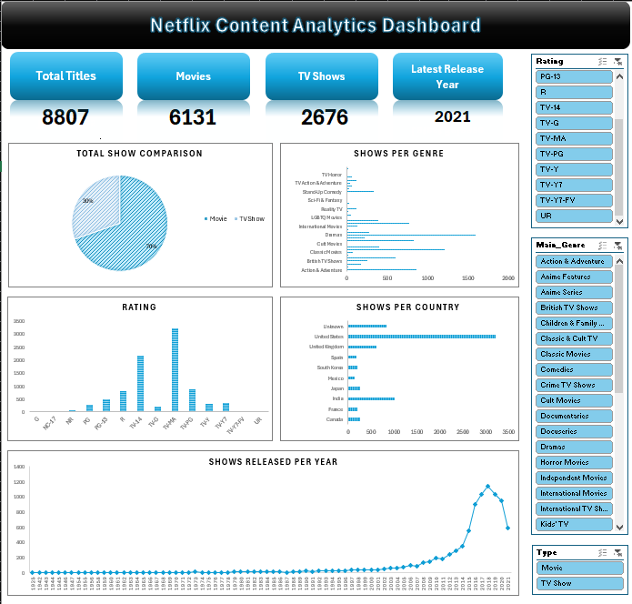
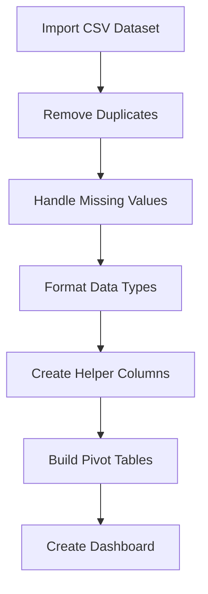

# 🎬 Netflix Content Analytics Dashboard

> An interactive Microsoft Excel dashboard project built using Pivot Tables, Pivot Charts, Slicers, Advanced Formulas, and Data Cleaning techniques to analyze Netflix content trends.

---

# 📌 Project Overview

This project analyzes the **Netflix Titles Dataset** and transforms raw CSV data into a fully interactive analytics dashboard inside Microsoft Excel.

The dashboard provides insights into:
- 🎥 Movies vs TV Shows
- 🌍 Content distribution by country
- 🎭 Genre popularity
- 🔞 Rating distribution
- 📈 Release trends over time

The goal of this project was to demonstrate:
- Data Cleaning
- Data Analysis
- Dashboard Design
- Interactive Reporting
- Excel Business Intelligence Skills

---

# 🖥️ Dashboard Preview



---

# 🚀 Features

## ✅ Data Cleaning & Preparation
- Removed duplicates
- Handled missing/null values
- Standardized columns
- Created helper columns for analysis

---

## 📊 Interactive Dashboard
The dashboard includes:
- KPI Cards
- Pivot Charts
- Dynamic Slicers
- Interactive Filtering
- Professional Layout Design

---

## 📈 Visualizations Included

| Visualization | Purpose |
|---|---|
| Pie Chart | Movies vs TV Shows comparison |
| Bar Chart | Shows per Genre |
| Bar Chart | Shows per Country |
| Column Chart | Rating Distribution |
| Line Chart | Release Trend Over Years |

---

# 🛠️ Excel Features Used

## 📌 Pivot Tables
Used for:
- aggregation
- summarization
- dynamic analysis

---

## 📌 Pivot Charts
Created interactive visual reports connected with slicers.

---

## 📌 Slicers
Interactive filters for:
- Rating
- Genre
- Type

---

## 📌 Advanced Formulas

### Functions Used

```excel
IF()
COUNTIF()
LEFT()
SEARCH()
COUNTA()
ROWS()
INDEX-MATCH()
```

---

## 📌 Conditional Formatting
Used for:
- highlighting
- improving readability
- dashboard aesthetics

---

# 🧹 Data Cleaning Workflow



---

# 📂 Project Structure

```bash
📦 Netflix-Excel-Dashboard
 ┣ 📄 DushyantV_ExcelDashboard.xlsx
 ┣ 📄 README.md
 ┣ 🖼️ Screenshot.png
 ┗ 📄 netflix_titles.csv
```

---

# 📊 Key Insights

- 🎬 Movies dominate Netflix content library
- 📈 Content production increased significantly after 2015
- 🌍 United States contributes the highest number of titles
- 🔞 TV-MA is the most common rating category
- 🎭 Drama and International content are among the most popular genres

---

# 🎯 Skills Demonstrated

## 📌 Data Analytics
- Data Cleaning
- Exploratory Data Analysis
- Trend Analysis

---

## 📌 Microsoft Excel
- Pivot Tables
- Pivot Charts
- Dashboard Design
- Interactive Reporting
- Advanced Formulas

---

## 📌 Data Visualization
- KPI Design
- Chart Formatting
- Business Dashboard Layout

---

# 💡 Future Improvements

Potential future enhancements:
- Power BI version
- Automated Power Query transformations
- Dynamic KPI cards
- Dark mode dashboard theme
- Advanced forecasting analytics

---

# 📥 Dataset Source

Dataset used:
- Netflix Titles Dataset from Kaggle

---

# 🏁 Conclusion

This project demonstrates how Microsoft Excel can be used as a powerful Business Intelligence and Analytics tool for transforming raw datasets into interactive dashboards and actionable insights.

---

# 👨‍💻 Author

### Dushyant Vasoya

📌 Excel Dashboard Project  
📌 Data Analytics & Visualization  
📌 Interactive Business Intelligence Reporting

---

# ⭐ If You Like This Project

Feel free to:
- ⭐ Star the repository
- 🍴 Fork the project
- 📢 Share feedback

---
